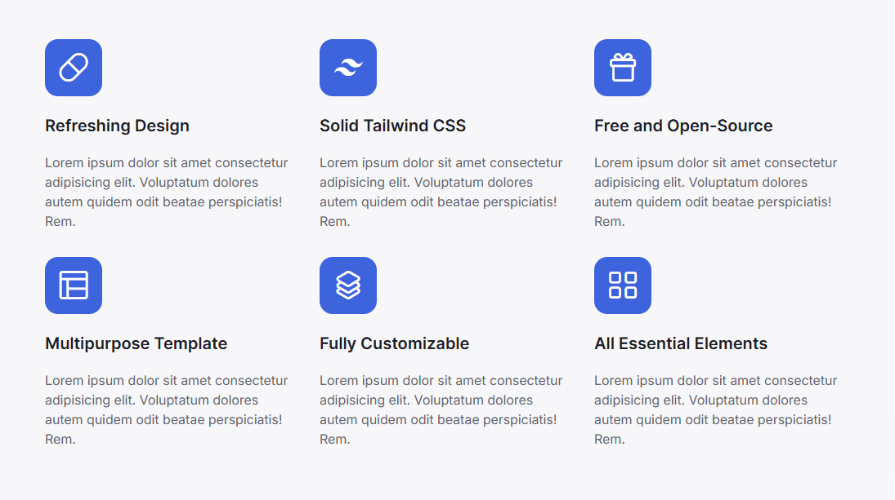

# Creating Feature

<figure style="text-align: center;">
  
  <figcaption>Feature</figcaption>
</figure>

## Step 1: Installing Packages

1. **Installation**

This package is designed to implement Drag-and-Drop sorting of objects in the Django admin panel.

```Bash copy
pip install django-admin-sortable2
```

Modern integration of the popular WYSIWYG editor CKEditor 5 into Django.

```Bash copy
pip install django django-ckeditor-5
```

A tool for cleaning (sanitizing) HTML code entered by the user.

```Bash copy
pip install django nh3
```

2. **Registration**

Add it to `INSTALLED_APPS` in your `settings.py` file:

```Python copy
INSTALLED_APPS = [
    ...
    'adminsortable2'
    'django_ckeditor_5',
    ...
]
```

## Step 2: Setting up the Model (models.py)

```Python copy
# To perform sanitization using django-nh3
import nh3
from django.db import models
# Text field with HTML support and built-in CKEditor 5 editor
from django_ckeditor_5.fields import CKEditor5Field
# To access settings from the model (for example, to get allowed tags and attributes)
from django.conf import settings

# Model for the section itself (groups cards)
class FeatureSection(models.Model):
    title = models.CharField("Section name", max_length=200)
    slug = models.SlugField("Slug", unique=True)

    def __str__(self):
            return self.title

    class Meta:
        verbose_name = "Benefits Section"
        verbose_name_plural = "Benefits Sections"

# Model of a separate benefit card
class FeatureCard(models.Model):
    section = models.ForeignKey(FeatureSection, related_name="cards", on_delete=models.CASCADE, verbose_name="Section")
    # Field for the icon (you can insert the name of the LineIcons class)
    icon_code = models.CharField("Icon class", max_length=50, help_text="Enter the icon class")
    title = models.CharField("Title", max_length=100)
    # Description using CKEditor 5
    content = CKEditor5Field("Description", config_name='default')
    order = models.PositiveIntegerField("Order", default=0)

    def __str__(self):
        return self.title
    
    class Meta:
        ordering = ['order', 'title', 'id']
        verbose_name = "Advantage card"
        verbose_name_plural = "Benefit cards"

    def save(self, *args, **kwargs):
        if self.content:
            # Use .get() or getattr to have a "spare" empty set
            tags = getattr(settings, 'NH3_ALLOWED_TAGS', set())
            attrs = getattr(settings, 'NH3_ALLOWED_ATTRIBUTES', {})
            
            self.content = nh3.clean(
                self.content,
                tags=tags,
                attributes=attrs
            )
        super().save(*args, **kwargs)
```

## Step 3: Setting up the admin panel (admin.py)

```Python copy
from django.contrib import admin
# Local files: If you want to link not to a website,
# but to a file within your project (for example, a PDF manual
# in the static folder), use the static function
from django.templatetags.static import static
# To display images in the admin panel (for example, for feature cards)
from django.utils.html import format_html
# Special mixin for inlines
from adminsortable2.admin import SortableAdminBase, SortableInlineAdminMixin
from .models import FeatureSection, FeatureCard

# 3.1 Describe how the cards will look inside the section
class FeatureCardInline(SortableInlineAdminMixin, admin.StackedInline):
    model = FeatureCard
    # Fields that will be displayed when adding/editing cards within a group
    fields = ('title', 'content', 'icon_code')
    # If this is a new entry, show 1 empty line; otherwise, show 0
    # (to avoid unnecessary empty fields when editing existing feature cards)
    def get_extra(self, request, obj=None, **kwargs):
        return 1 if obj is None else 0
    # Add a tooltip for the icon_code field so administrators know how to use icons.
    # The get_form method doesn't work in the TabularInline and StackedInline classes,
    # as it's only intended for the main ModelAdmin class.
    # There are three ways to add a tooltip for inline fields:
    # 1. Override the get_formset method and add the tooltip there (medium load).
    # 2. Use formfield_for_dbfield for a specific field (light load).
    # 3. ModelForm, if there are many fields, or if you need complex inline validation.
    # Override the tooltip specifically here.
    def get_formset(self, request, obj=None, **kwargs):
        formset = super().get_formset(request, obj, **kwargs)
        # Find the field in the basic form of the set
        field = formset.form.base_fields.get('icon_code')
        if field:
            field.help_text = format_html(
                'Use icons from <a href="{}" target="_blank">LineIcons 4.0 Library</a>',
                static('files/LineIcons 4.0 Viewer.html')
            )
        return formset

# 3.2 Register the main section model
@admin.register(FeatureSection)
class FeatureSectionAdmin(SortableAdminBase, admin.ModelAdmin):
    list_display = ('title', 'slug')
    # Autocomplete slug from title
    prepopulated_fields = {"slug": ("title",)}
    inlines = [FeatureCardInline]
```

## Step 4: Setting up the Settings (settings.py)

* Basic setup of CKEditor 5

* Basic setup of the nh3 sanitizer

```Python copy
# Basic setup of CKEditor 5
CKEDITOR_5_CONFIGS = {
    'default': {
        'toolbar':['heading', '|', 'bold', 'italic', 'link', 'bulletedList', 'numberedList', 'blockQuote', ],
    },
}


# Basic setup of the nh3 sanitizer
NH3_ALLOWED_TAGS = {'p', 'b', 'i', 'strong', 'em', 'a', 'ul', 'li', 'ol', 'br', 'h2', 'h3'}
NH3_ALLOWED_ATTRIBUTES = {
    'a': {'href', 'title', 'target'},
    'p': {'style', 'class'},
}
```

## Step 5: Setting up your website's "road map" (urls.py)

The file is located `config/urls.py`.

```Python copy
urlpatterns = [
    ...
    path("ckeditor5/", include('django_ckeditor_5.urls')),
    ...
]
```

## Step 6: Display your custom menu anywhere on the site with one short command

1. **Create the folder structure**

Inside your app (let’s assume it’s called core), create a directory named `templatetags`. It must contain an empty `__init__.py` file.

```Bash copy
core/
    templates/
        file-loader/
            loader.html
        feature/
            feature-default.html
            feature-faq.html
            feature-services.html
	    index.html
    models.py
    templatetags/
        __init__.py
        feature_tags.py
```

2. **Write the tag logic (`feature_tags.py`)**

In this file, define how Django should fetch the `cards` from the database.

```Python copy
from django import template
# Let's assume you have a menu model
from core.models import FeatureSection

register = template.Library()

@register.inclusion_tag('file-loader/loader.html', takes_context=True)
def show_feature(context, slug, template_name='feature-default'):
    try:
        # We get the entire menu object together with the elements
        feature = FeatureSection.objects.prefetch_related('cards').get(slug=slug)
        cards = feature.cards.all().order_by('order')
    except FeatureSection.DoesNotExist:
        feature = None
        cards = []
    # We create a path to a specific layout file
    full_template_path = f'feature/{template_name}.html'
    return {
        'feature': feature,
        'feature_cards': cards,
        'template_name': full_template_path,
        # To make active links work
        'request': context.get('request'),
    }
```

3. **Create the cards services template (`core/templates/feature/feature-services.htmll`)**

This file will contain only the HTML code for the `cards` itself. Create it in the `core/templates/feature/` directory.

```HTML copy

<div class="row">
    
    <div class="scroll-revealed col-12 sm:col-6 lg:col-4">
      <div class="group hover:-translate-y-1">
        <div
          class="w-[70px] h-[70px] rounded-2xl mb-6 flex items-center justify-center text-[37px]/none bg-primary text-primary-color"
        >
          <i class="lni {{ card.icon_code|slugify }}"></i>
        </div>
        <div class="w-full">
          <h4 class="text-[1.25rem]/tight font-semibold mb-5">
            {{ card.title }}
          </h4>
          {{ card.content|safe }}
        </div>
      </div>
    </div>
    
</div>

```

4. **Create the cards faq template (`core/templates/feature/feature-faq.htmll`)**

This file will contain only the HTML code for the `cards` itself. Create it in the `core/templates/feature/` directory.

```HTML copy

<div class="grid gap-x-8 gap-y-12 grid-cols-1 lg:grid-cols-2">
    
    <div class="scroll-revealed flex">
      <div
        class="mr-4 flex h-[50px] w-full max-w-[50px] items-center justify-center rounded-xl bg-primary text-primary-color text-[28px] sm:mr-6 sm:h-[60px] sm:max-w-[60px] sm:text-[32px]"
      >
        <i class="lni {{ card.icon_code|slugify }}"></i>
      </div>
      <div class="w-full">
        <h3
          class="mb-6 text-xl font-semibold text-body-light-12 dark:text-body-dark-12 sm:text-2xl lg:text-xl xl:text-2xl"
        >
          {{ card.title }}
        </h3>
        <div class="text-body-light-11 dark:text-body-dark-11">
          {{ card.content|safe }}
        </div>
      </div>
    </div>
    
</div>

```

5. **Create a default cards template (`core/templates/feature/feature-default.html`)**

This file will contain plain HTML without CSS styles. It serves as a fallback if no specific template is defined. Create it in `core/templates/feature/`

```HTML copy

<div>
    
    <div">
      <div>
        <i class="lni {{ card.icon_code|slugify }}"></i>
      </div>
      <div>
        <h3>
          {{ card.title }}
        </h3>
        <div>
          {{ card.content|safe }}
        </div>
      </div>
    </div>
    
</div>

```

6. **Create the `loader.html` wrapper (`core/templates/file-loader/loader.html`)**

This file acts as a dispatcher. It will dynamically include the template you specify.

```HTML copy

```

7. **Use it anywhere!**

Now, in your main template (e.g., `index.html`), you need to do two things:

* Load the tag library at the very top.

```HTML copy

```

* Call the command.

```HTML copy

```