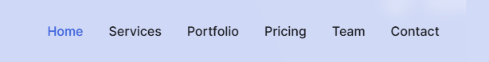

# Creating Menu

<figure style="text-align: center;">
  
  <figcaption>Menu header</figcaption>
</figure>

## Step 1: Installation and configuration django-admin-sortable2

1. **Installation**

```Bash copy
pip install django-admin-sortable2
```

2. **Registration**

Add it to `INSTALLED_APPS` in your `settings.py` file:

```Python copy
INSTALLED_APPS = [
    ...
    'adminsortable2',
    ...
]
```

## Step 2: Setting up the Model (models.py)

```Python copy
from django.db import models

# In the admin panel, there is a Menu object, at the bottom you will see a table with all its MenuItems.
class Menu(models.Model):
    title = models.CharField("Menu Title", max_length=100)
    slug = models.SlugField("Slug", unique=True)

    def __str__(self):
        return self.title
    
    class Meta:
        verbose_name = "Site Menu"
        verbose_name_plural = "Site Menu"

# Creating menu items in the admin panel
class MenuItem(models.Model):
    # Add a ForeignKey relationship
    menu = models.ForeignKey(Menu, related_name='items', on_delete=models.CASCADE)
    title = models.CharField("Name", max_length=100)
    url = models.CharField("Link", max_length=200, help_text="For example: #about или https://google.com")
    order = models.PositiveIntegerField("Order", default=0)

    def __str__(self):
        return self.title
    # Sort by the order field, then by title and id for order stability
    class Meta:
        ordering = ['order', 'title', 'id']
        verbose_name = "Menu item"
        verbose_name_plural = "Menu items"
```

## Step 3: Setting up the admin panel (admin.py)

```Python copy
from django.contrib import admin
# Special mixin for inlines
from adminsortable2.admin import SortableAdminBase, SortableInlineAdminMixin
from .models import Menu, MenuItem,

# 1.1 Describe how the items will look inside the menu
class MenuItemInline(SortableInlineAdminMixin, admin.TabularInline):
    model = MenuItem
    # Fields that will be displayed when adding/editing menu items within a group
    fields = ('title', 'url')
    # If this is a new entry, display 1 empty line; otherwise, display 0
    # (to avoid unnecessary empty fields when editing existing menu items)
    def get_extra(self, request, obj=None, **kwargs):
        return 1 if obj is None else 0

# 1.2 Register the main menu model
@admin.register(Menu)
class MenuAdmin(SortableAdminBase, admin.ModelAdmin):
    list_display = ('title', 'slug')
    # Autocomplete slug from title
    prepopulated_fields = {'slug': ('title',)}
    inlines = [MenuItemInline]
```

## Step 4: Setting up the Settings (settings.py)

* Make sure the request processor is enabled in the `TEMPLATES` section (it's enabled by default in new Django projects). This gives the template access to the `request` object.

* Make sure Django knows where to find your templates. In `settings.py`, the `TEMPLATES` section should look something like this:

```Python copy
TEMPLATES = [
    {
        ...
        'DIRS': [BASE_DIR / 'templates'],
        ...
        'OPTIONS': {
            'context_processors': [
                'django.template.context_processors.request',
                ....
            ],
        },
    },
]
```

## Step 5: Display your custom menu anywhere on the site with one short command

1. **Create the folder structure**

Inside your app (let’s assume it’s called core), create a directory named `templatetags`. It must contain an empty `__init__.py` file.

```Bash copy
core/
    templates/
        file-loader/
            loader.html
        menu/
            menu-default.html
            menu-header.html
	    index.html
    models.py
    templatetags/
        __init__.py
        menu_tags.py
```

2. **Write the tag logic (`menu_tags.py`)**

In this file, define how Django should fetch the menu items from the database.

```Python copy
from django import template
# Let's say you have a menu model
from core.models import Menu

register = template.Library()

@register.inclusion_tag('file-loader/loader.html', takes_context=True)
def show_menu(context, slug, template_name='menu-default'):
    try:
        # We get the entire menu object together with its elements
        menu = Menu.objects.prefetch_related('items').get(slug=slug)
        items = menu.items.all().order_by('order')
    except Menu.DoesNotExist:
        menu = None
        items = []
    # We create a path to a specific layout file
    full_template_path = f'menu/{template_name}.html'
    return {
        'menu': menu,
        'menu_items': items,
        'template_name': full_template_path,
        # To make active links work
        'request': context.get('request'),
    }
```

3. **Create the menu template (`core/templates/menu/menu-header.html`)**

This file will contain only the HTML code for the menu list itself. Create it in the `core/templates/menu/` directory.

```HTML copy

<div>
    <button
      type="button"
      class="ic-navbar-toggler absolute right-4 top-1/2 block -translate-y-1/2 rounded-md px-3 py-[6px] text-[22px]/none text-primary-color ring-primary focus:ring-2 lg:hidden"
      data-web-toggle="navbar-collapse"
      data-web-target="navbarMenu"
      aria-expanded="false"
      aria-label="Toggle navigation menu"
    >
      <i class="lni lni-menu"></i>
    </button>

    <nav
      id="navbarMenu"
      class="ic-navbar-collapse absolute right-4 top-[80px] w-full max-w-[250px] rounded-lg hidden bg-primary-light-1 py-5 shadow-lg dark:bg-primary-dark-1 lg:static lg:block lg:w-full lg:max-w-full lg:bg-transparent lg:py-0 lg:shadow-none dark:lg:bg-transparent xl:px-6"
    >
      <ul
        class="block lg:flex"
        role="menu"
        aria-label="Navigation menu"
      >
        
        <li class="group relative">
            <a
            href="{{ item.url }}"
            class="ic-page-scroll mx-8 flex py-2 text-base font-medium text-body-light-12 group-hover:text-primary dark:text-body-dark-12 lg:mx-0lg:mr-0 lg:inline-flex lg:px-0 lg:py-6 lg:text-primary-color lg:dark:text-primary-color lg:group-hover:text-primary-color lg:group-hover:opacity-70active"
            role="menuitem"
            > {{ item.title }}
            </a>
        </li>
                   
      </ul>
    </nav>
</div>

```

4. **Create a default menu template (`core/templates/menu/menu-default.html`)**

This file will contain plain HTML without CSS styles. It serves as a fallback if no specific template is defined. Create it in `core/templates/menu/`

```HTML copy

<ul>
    
        <li>
            <a
            href="{{ item.url }}"
            > {{ item.title }}
            </a>
        </li>
    
</ul>

```

5. **Create the `loader.html` wrapper (`core/templates/file-loader/loader.html`)**

This file acts as a dispatcher. It will dynamically include the template you specify.

```HTML copy

```

6. **Use it anywhere!**

Now, in your main template (e.g., `index.html`), you need to do two things:

* Load the tag library at the very top.

```HTML copy

```

* Call the command.

```HTML copy

```

7. **Highlighting the "Active" menu item**

To help users understand which page they are currently on, add a simple check to the `menu-header.html` template.

```HTML copy
...
    <a
    ...
    class="...active"
    ...
    </a>
...
```

> [!IMPORTANT]
> For `request.path` to work inside the tag, ensure that `'django.template.context_processors.request'` is included in the `TEMPLATES` section of your `settings.py`.