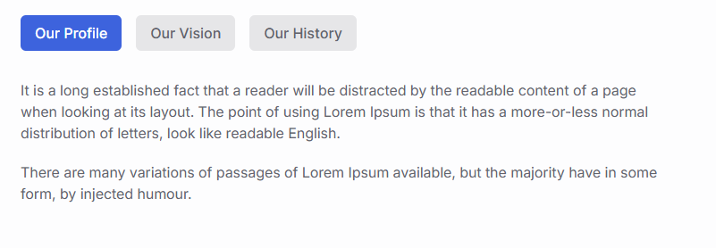

# Creating Tabs

<figure style="text-align: center;">
  
  <figcaption>Tabs</figcaption>
</figure>

## Step 1: Installing Packages

1. **Installation**

This package is designed to implement Drag-and-Drop sorting of objects in the Django admin panel.

```Bash copy
pip install django-admin-sortable2
```

Modern integration of the popular WYSIWYG editor CKEditor 5 into Django.

```Bash copy
pip install django django-ckeditor-5
```

A tool for cleaning (sanitizing) HTML code entered by the user.

```Bash copy
pip install django nh3
```

2. **Registration**

Add it to `INSTALLED_APPS` in your `settings.py` file:

```Python copy
INSTALLED_APPS = [
    ...
    'adminsortable2'
    'django_ckeditor_5',
    ...
]
```

## Step 2: Setting up the Model (models.py)

```Python copy
# To perform sanitization using django-nh3
import nh3
from django.db import models
# Text field with HTML support and built-in CKEditor 5 editor
from django_ckeditor_5.fields import CKEditor5Field
# To access settings from the model (for example, to get allowed tags and attributes)
from django.conf import settings

# In the admin panel, there is a Tab object, at the bottom you will see a table with all its TabItems.
class Tab(models.Model):
    title = models.CharField("Название группы табов", max_length=100)
    slug = models.SlugField("Слаг", unique=True)

    def __str__(self):
        return self.title

    class Meta:
        verbose_name = "Группа табов"
        verbose_name_plural = "Группы табов"

# Creating tabs in the admin panel
class TabItem(models.Model):
    # Add a ForeignKey relationship
    group = models.ForeignKey(Tab, related_name='tabs', on_delete=models.CASCADE)
    title = models.CharField("Заголовок таба", max_length=50)
    content = CKEditor5Field('Контент', config_name='default')
    order = models.PositiveIntegerField("Порядок", default=0)

    def __str__(self):
        return self.title
    # Sort by the order field, then by title and id for order stability
    class Meta:
        ordering = ['order', 'title', 'id']
        verbose_name = "Таб"
        verbose_name_plural = "Табы"

    def save(self, *args, **kwargs):
        if self.content:
            # Use .get() or getattr to have a "spare" empty set
            tags = getattr(settings, 'NH3_ALLOWED_TAGS', set())
            attrs = getattr(settings, 'NH3_ALLOWED_ATTRIBUTES', {})
            
            self.content = nh3.clean(
                self.content,
                tags=tags,
                attributes=attrs
            )
        super().save(*args, **kwargs)
```

## Step 3: Setting up the admin panel (admin.py)

```Python copy
from django.contrib import admin
# Special mixin for inlines
from adminsortable2.admin import SortableAdminBase, SortableInlineAdminMixin
from .models import Tab, TabItem

# 2.1 Describe how tabs will look inside the menu
class TabItemInline(SortableInlineAdminMixin, admin.TabularInline):
    model = TabItem
    # Fields that will be displayed when adding/editing tabs within a group
    fields = ('title', 'content')
    # If this is a new entry, show 1 empty line; otherwise, show 0
    # (to avoid unnecessary empty fields when editing existing tabs)
    def get_extra(self, request, obj=None, **kwargs):
        return 1 if obj is None else 0

# 2.2 Register the main tab model
@admin.register(Tab)
class TabAdmin(SortableAdminBase, admin.ModelAdmin):
    list_display = ('title', 'slug')
    # Autocomplete slug from title
    prepopulated_fields = {'slug': ('title',)}
    inlines = [TabItemInline]

```

## Step 4: Setting up the Settings (settings.py)

* Basic setup of CKEditor 5

* Basic setup of the nh3 sanitizer

```Python copy
# Basic setup of CKEditor 5
CKEDITOR_5_CONFIGS = {
    'default': {
        'toolbar':['heading', '|', 'bold', 'italic', 'link', 'bulletedList', 'numberedList', 'blockQuote', ],
    },
}


# Basic setup of the nh3 sanitizer
NH3_ALLOWED_TAGS = {'p', 'b', 'i', 'strong', 'em', 'a', 'ul', 'li', 'ol', 'br', 'h2', 'h3'}
NH3_ALLOWED_ATTRIBUTES = {
    'a': {'href', 'title', 'target'},
    'p': {'style', 'class'},
}
```

## Step 5: Setting up your website's "road map" (urls.py)

The file is located `config/urls.py`.

```Python copy
urlpatterns = [
    ...
    path("ckeditor5/", include('django_ckeditor_5.urls')),
    ...
]
```

## Step 6: Display your custom menu anywhere on the site with one short command

1. **Create the folder structure**

Inside your app (let’s assume it’s called core), create a directory named `templatetags`. It must contain an empty `__init__.py` file.

```Bash copy
core/
    templates/
        file-loader/
            loader.html
        tabs/
            tabs-about-us.html
            tabs-default.html
	    index.html
    models.py
    templatetags/
        __init__.py
        tabs_tags.py
```

2. **Write the tag logic (`tabs_tags.py`)**

In this file, define how Django should fetch the `tabs` from the database.

```Python copy
from django import template
# Let's assume you have a menu model
from core.models import Tab

register = template.Library()

@register.inclusion_tag('file-loader/loader.html', takes_context=True)
def show_tabs(context, slug, template_name='tabs-default'):
    try:
        # We get the entire menu object together with the elements
        tab = Tab.objects.prefetch_related('tabs').get(slug=slug)
        tabs = tab.tabs.all().order_by('order')
    except Tab.DoesNotExist:
        tab = None
        tabs = []
    # We create a path to a specific layout file
    full_template_path = f'tabs/{template_name}.html'
    return {
        'tab': tab,
        'tabs': tabs,
        'template_name': full_template_path,
        # To make active links work
        'request': context.get('request'),
    }
```

3. **Create the tabs template (`core/templates/tabs/tabs-about-us.html`)**

This file will contain only the HTML code for the tabs itself. Create it in the `core/templates/tabs/` directory.

```HTML copy

<div class="tabs scroll-revealed">
    <nav
      class="tabs-nav flex flex-wrap gap-4 my-8"
      role="tablist"
      aria-label="About us tabs"
    >
    
      <button
        type="button"
        class="tabs-link inline-block py-2 px-4 rounded-md text-body-light-12 dark:text-body-dark-12 bg-body-light-12/10 dark:bg-body-dark-12/10 text-inherit font-medium hover:bg-primary hover:text-primary-color focus:bg-primary focus:text-primary-coloractive"
        data-web-toggle="tabs"
        data-web-target="tabs-panel-{{ tab.title|slugify }}"
        id="tabs-list-{{ tab.title|slugify }}"
        role="tab"
        aria-controls="tabs-panel-{{ tab.title|slugify }}"
      >
      {{ tab.title }}
      </button>
    
    </nav>
    
    <div
      class="tabs-content mt-4"
      id="tabs-panel-{{ tab.title|slugify }}"
      tabindex="-1"
      role="tabpanel"
      aria-labelledby="tabs-list-{{ tab.title|slugify }}"
    >
      {{ tab.content|safe }}
    </div>
    
</div>

```

4. **Create a default tabs template (`core/templates/tabs/tabs-default.html`)**

This file will contain plain HTML without CSS styles. It serves as a fallback if no specific template is defined. Create it in `core/templates/tabs/`

```HTML copy

<div>
    <nav>
    
      <button>
      {{ tab.title }}
      </button>
    
    </nav>
    
    <div>
      {{ tab.content|safe }}
    </div>
    
</div>

```

5. **Create the `loader.html` wrapper (`core/templates/file-loader/loader.html`)**

This file acts as a dispatcher. It will dynamically include the template you specify.

```HTML copy

```

6. **Use it anywhere!**

Now, in your main template (e.g., `index.html`), you need to do two things:

* Load the tag library at the very top.

```HTML copy

```

* Call the command.

```HTML copy

```

7. **Highlighting the "Active" tab item**

To help users understand which page they are currently on, add a simple check to the `tabs-about-us.html` template.

```HTML copy
...
    <a
    ...
    class="...active"
    ...
    </a>
...
```

> [!IMPORTANT]
> For `request.path` to work inside the tag, ensure that `'django.template.context_processors.request'` is included in the `TEMPLATES` section of your `settings.py`.